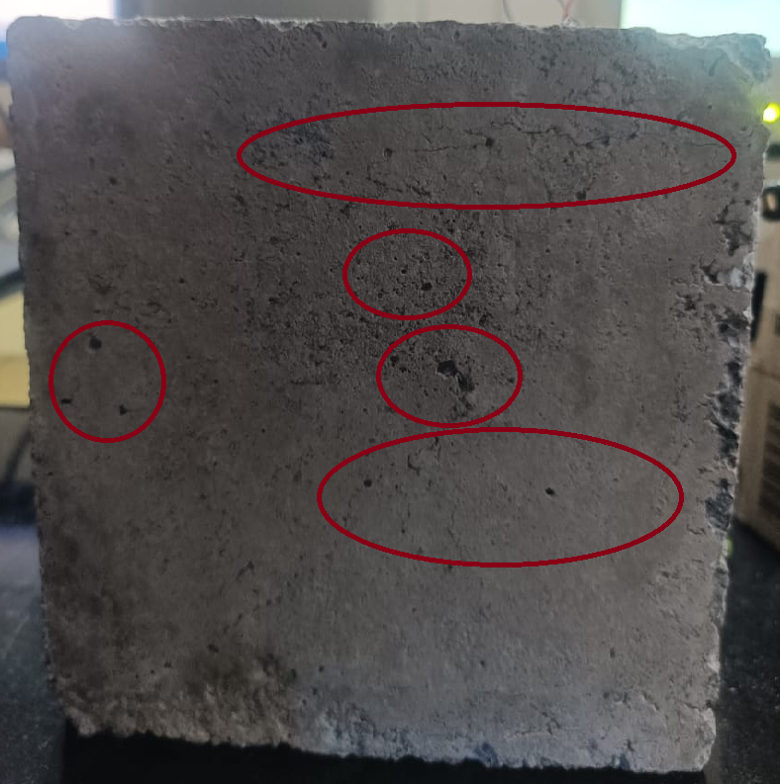
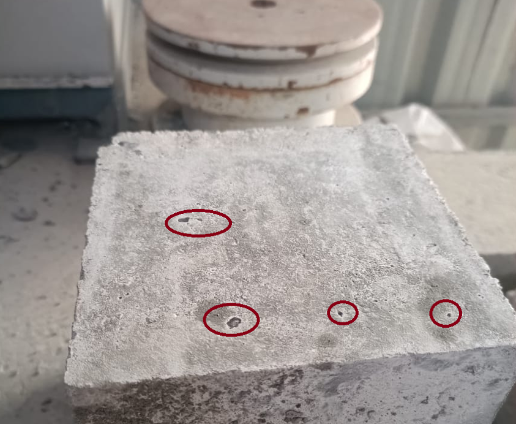
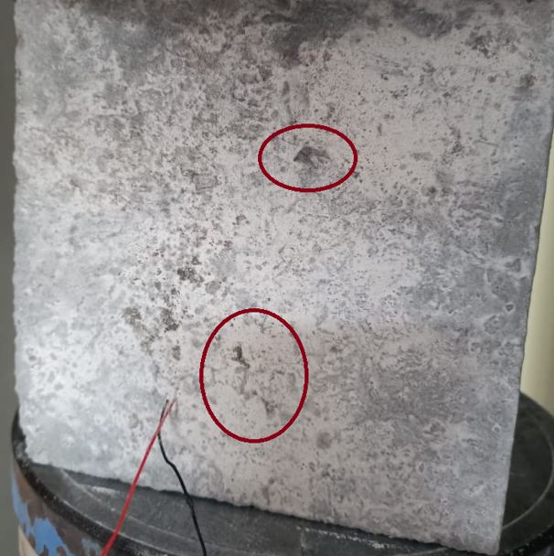
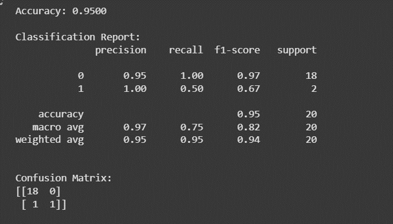
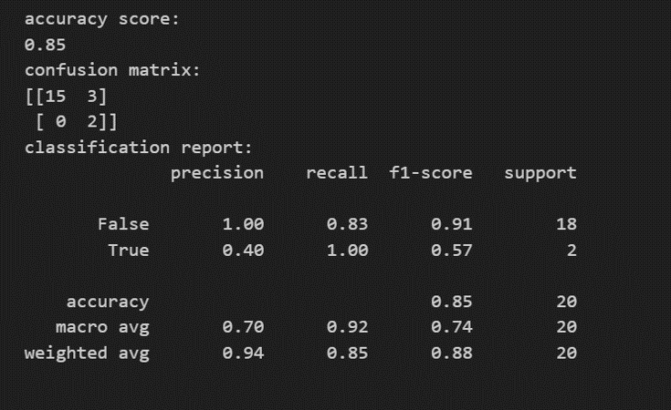
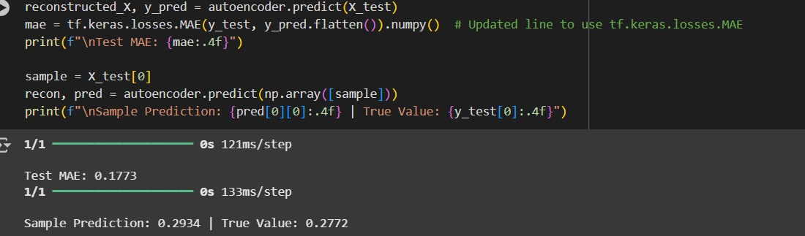

# CrackDetection
Experimental Investigation of Crack Detection in Concrete: A smart structural health monitoring approach utilizing progressive loading data, Piezoelectric sensors, and advanced ML/DL models
# Experimental Investigation of Crack Detection in Concrete Using Sensors and Machine Learning

## Overview
This repository contains the code, data analysis, and models for an automated Structural Health Monitoring (SHM) system. The project leverages Piezoelectric (PZT) sensors and the Electromechanical Impedance (EMI) technique to detect early-stage damage and cracks in concrete structures under progressive loading.

By combining unsupervised feature extraction with supervised classification, this project demonstrates how advanced machine learning architectures can provide real-time, non-destructive monitoring for sustainable infrastructure, outperforming traditional manual inspection methods.

## Progressive Loading Visualizations
Below are visual examples of the concrete specimens at various stages of ultimate load failure:

**30% Load Capacity**

**50% Load Capacity**

**90% Load Capacity (Failure)**

## Key Features & Methodology
* **Data Collection:** PZT sensors embedded in concrete specimens, capturing impedance data across progressive loading stages (0% to 100% ultimate load).
* **Signal Processing:** Calculation of conductance values from impedance data, with frequencies normalized on a 1-100 scale.
* **Dual-Output Autoencoder:** A custom deep learning architecture that simultaneously performs unsupervised feature representation (reconstruction) and supervised regression (predicting conductance at structural failure). 
* **CatBoost Classifier:** A gradient boosting model utilizing latent representations for binary crack detection (damaged vs. undamaged), optimized for safety-critical applications.

## Performance & Results
* **Autoencoder Regression:** Achieved an R-squared of **0.877** and a Mean Absolute Error (MAE) of **0.146**.
* **Autoencoder Classification:** Achieved **95%** overall accuracy.

* **Autoencoder Classification**

* **CatBoost Classification:** Achieved **85%** accuracy with a **perfect recall (1.00)** for the damaged class, ensuring zero missed cracks (no false negatives).
* **CatBoost Classification**

* **Loss Function:** The Autoencoder utilized a multi-task learning approach with the following objective:
  `L_total = 0.5 * L_reconstruction + 1.5 * L_prediction`

  * **Result**

## Repository Structure
* `model1.ipynb` / `model2.ipynb`: Jupyter notebooks containing the data preprocessing, Autoencoder architecture, and CatBoost training pipelines.
* `updated_impedance_with_all_conductance.csv`: The normalized dataset containing frequency and conductance measurements.
* `images/`: Visualizations of concrete loading stages, model predictions, and feature importance.
